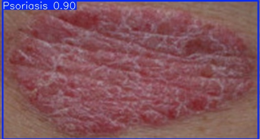

# Psoriasis Detection API

This project provides an automated pipeline for detecting psoriasis in skin images using deep learning models. It integrates a U²-Net segmentation model and a YOLOv8 detection model, served via a FastAPI backend for easy frontend integration.

## Project Structure

```
├── detector_api.py         # FastAPI server handling image uploads and detection
├── detector.py             # U²-Net and YOLO model logic
├── psoriasis_detector.pt   # Trained YOLOv8 model for skin condition classification
└── U2NET/                  # Directory for U²-Net model (not included here)
```

## Features

- **YOLOv8-based psoriasis detection**
- **U²-Net segmentation** to focus detection on skin regions
- **FastAPI endpoint** to receive image files and return predictions
- Simple response: `"psoriasis"` if detected with confidence ≥ 70%, otherwise `"healthy"`

## Installation

1. **Clone the repository** and set up the environment:

```bash
pip install fastapi uvicorn torch torchvision opencv-python pillow numpy ultralytics
```

2. **Download U²-Net weights**

Place the `u2net.pth` file inside:
```
U2NET/saved_models/u2net/u2net.pth
```

3. **Ensure `psoriasis_detector.pt`** is in the project root. This is your trained YOLOv8 model.

## ▶Running the API

```bash
uvicorn detector_api:app --reload
```

Then access the API at:  
`http://127.0.0.1:8000/docs` to test via Swagger UI.

## API Endpoint

### `POST /predict/`

- **Request**: Upload an image file (JPEG/PNG)
- **Response**:
```json
{ "result": "psoriasis" }
```
or
```json
{ "result": "healthy" }
```

## How it Works

1. **Preprocess** image using U²-Net to segment the skin area.
2. **Crop** the image around the skin contour.
3. **Run YOLOv8** detection on the cropped image.
4. If a box of class `psoriasis` has confidence ≥ 60%, return `"psoriasis"`.

## Demo

## Notes

- Default frontend CORS is set to `http://localhost:3000`. Change in `detector_api.py` as needed.
- Make sure CUDA is enabled for GPU inference (`.to("cuda")`).

